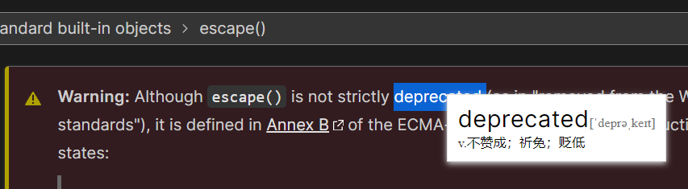

# Translation Extension

> I wish the translation will show up when I pick a word.

> I could easily disable the function in two clicks.

Now, you could translate the word by selecting it.

The translation is powered by Bing Translation. Thanks a lot.

I may postpone the development as it meets my essential need, now I could start
reading the English website with easy translator.

# Install
I don't have plan to upload to store.
You could install it by:
* Settings Extension
* Load unpacked
* select `src\` folder.
